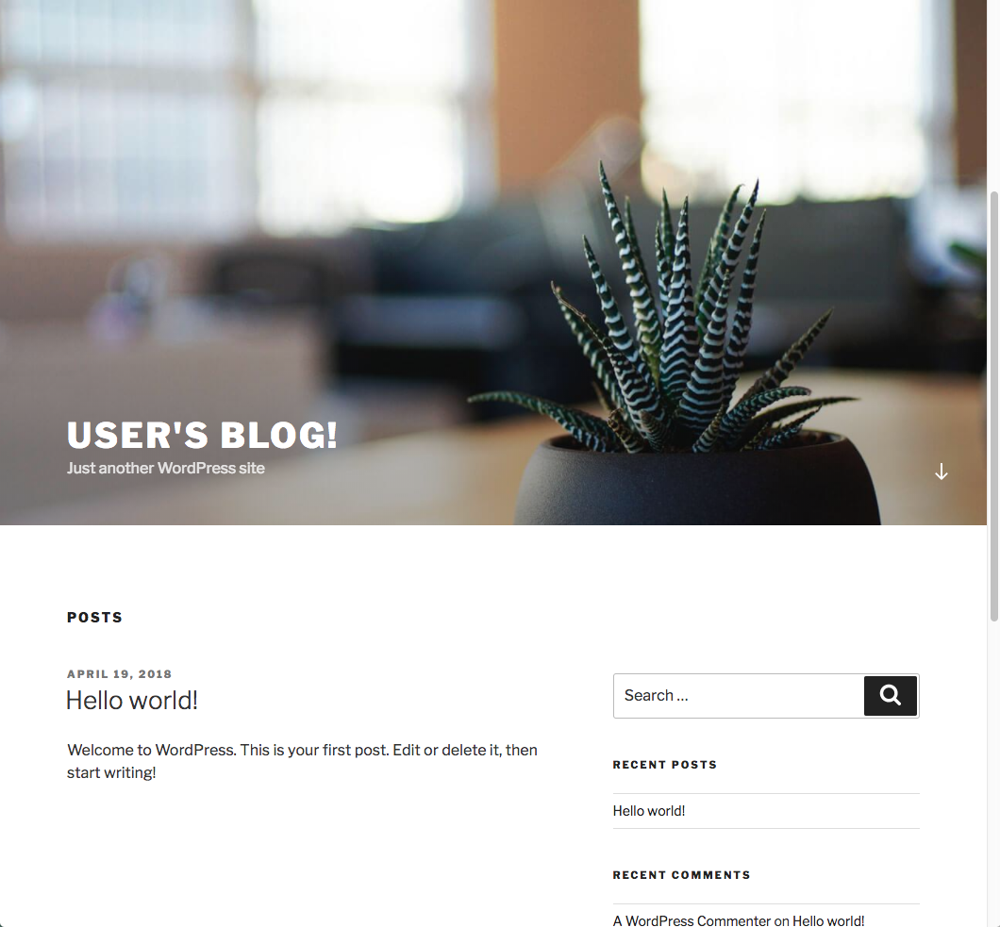

# Wordpress Terraform

# About

Install Wordpress in the AWS Cloud using Terraform

# Credit

With assistance from http://architecture.ginocoates.com/2017/01/01/terraforming-wordpress-on-aws/

# FAQ

Q) You derp, Wordpress and Terraform are easy, why did you do this?
A) 'cause Im not a uber-TF-brain like you; learning takes time and practice.

Q) I did everything it said but when I use the DNS address nothing happens, why?!
A) Terraform will output success when AWS receives the request to provision the EC2 instance; however, the instance still takes time to start up.

Q) Can I use this?
A) Yes, in accordance to the attached MIT Lic.

Q) Why am I getting charged by AWS?
A) Most likely reason is that you might have forgot to run the `terraform destroy` command to remove the resources that were created.

# Requirements
An (AWS)[https://aws.amazon.com/] account
(aws-cli)[https://docs.aws.amazon.com/cli/latest/userguide/installing.html]
Terminal
(Terraform)[https://www.terraform.io/]

# Support

Email: me@davidjeddy.com
Twitter: https://twitter.com/David_J_Eddy
Web: https://davidjeddy.com

# Usage

## Dependencies

Create a key pair in your (AWS console)[https://us-east-2.console.aws.amazon.com/ec2/v2/home?region=us-east-2#KeyPairs:sort=keyName], call it `aws`.
Download the `aws.pem` keypair

 - cd /to/your/project/root/parent/directory
 - git clone https://github.com/davidjeddy/wordpress-terraform.git
 - cd wordpress-terraform
 - terraform init
 - cp ~/your/downloads/aws.pem ./aws.pem

## Start

 - terraform  plan --out terraform.plan --var-file=./variables.tfvars
 - terraform apply terraform.plan

## End

When you are all done remove all the created resources using
 - terraform destroy
